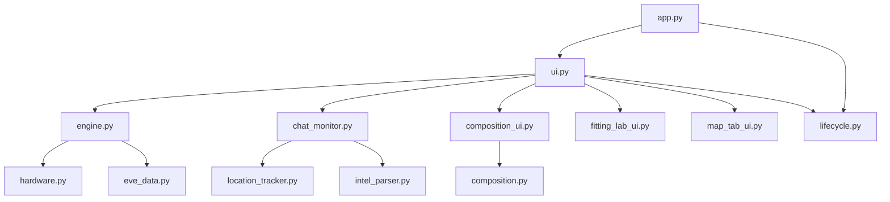

# A.U.R.A. Developer Guide

Internal reference for contributors working on the v0.2.0-alpha1 codebase.

## Module map

| Module | Purpose |
|--------|---------|
| `app.py` | Entry point: Python version gate, DPI, global excepthook, temp cleanup at startup |
| `ui.py` | Main PyQt6 window, tabs, worker thread, modal analyzers |
| `lifecycle.py` | Ordered shutdown and `cleanup_temp_files()` |
| `engine.py` | LLM inference (`UnifiedInferenceEngine`) and OpenVINO coprocessor mesh |
| `hardware.py` | Device detection and workload routing |
| `error_handler.py` | AURA-ERR codes, `log_diagnostic_error`, HTML error formatting |
| `chat_monitor.py` | EVE chat/gamelog tailer (`LiveChatMonitor` QThread) |
| `location_tracker.py` | Parse current system from Local/Gamelog lines |
| `intel_parser.py` | Single-line intel threat parsing |
| `dscan_parser.py` | D-scan and unified paste parsing |
| `fitting_parser.py` | EFT fit parsing |
| `fitting_stats.py` | Fit resource / EHP calculations |
| `fitting_lab_ui.py` | Fitting Lab tab UI |
| `composition.py` | Fleet vs D-scan role buckets and assessment rules |
| `composition_ui.py` | Composition tab UI |
| `eve_map.py` | Offline stargate graph (`data/eve_map.json`) |
| `map_tab_ui.py` | Map tab pan/zoom UI |
| `eve_data.py` | Ship/module database and tactical grounding |
| `ingestion.py` | Attachments: PDF, DOCX, images, text |
| `threat_alerts.py` | Jump-range threat toasts |
| `theme.py` | Angel Cartel stylesheets and palette |
| `config.py` | Runtime settings singleton |
| `input_safety.py` | HTML escape, length caps, path checks, LLM untrusted delimiters |

## Input safety

Untrusted text must pass through [`input_safety.py`](A.U.R.A. Source/input_safety.py):

- **UI HTML** — `escape_html()` before `QTextEdit.append` with user content
- **Labels / lists** — `safe_display_text()` or `Qt.TextFormat.PlainText`
- **Attachments** — size-capped in `ingestion.py` (`config.max_attachment_bytes`)
- **EVE logs** — `is_safe_log_file()` in `chat_monitor.py`
- **LLM prompts** — `wrap_untrusted()` delimiters + `config.max_llm_context_chars`

### Security checklist for new features

1. Does user or log content reach HTML? → escape it
2. Does content reach the LLM? → delimiter + clamp
3. Does content read from disk? → size cap + path under expected root
4. New `QTextEdit` for user input? → `setAcceptRichText(False)`

Prompt injection cannot be eliminated for a local assistant; document behavior and avoid executing model output as code.

## Dependency flow



## Error codes

All codes live in `error_handler.py` (`AURAErrorCode` + `ERROR_REGISTRY`). Log output: `A.U.R.A. Source/logs/crash.log` (rotates at 5 MB to `crash.log.old`).

| Series | Domain |
|--------|--------|
| 1xxx | Neural core / model loading |
| 2xxx | Hardware acceleration |
| 3xxx | Parsers and ingestion |
| 4xxx | Chat log monitor / file I/O |
| 5xxx | UI and worker threads |

## Lifecycle

**Startup (`app.py` → `ui.run_app`):**

1. `cleanup_temp_files()` — remove `__pycache__`, stale logs
2. `install_thread_excepthook()` — background thread errors → crash.log
3. `MainWindow` starts `LiveChatMonitor` and idle `QTimer`

**Shutdown (`closeEvent` + `run_app` after `app.exec()`):**

1. `lifecycle.shutdown_application(window)` — stop timer, tray, worker, monitor, unload engine/coprocessor, clear buffers
2. `cleanup_temp_files()` again
3. `sys.exit(ret)`

Coprocessor mesh threads join with up to **500 ms** per thread in `engine.NeuralHardwareCoProcessor.stop_all_workers`.

## Developer checks

From the repo root:

```bat
check_syntax.bat
```

Or manually (Python 3.12+):

```bat
python -m compileall -q -f "A.U.R.A. Source"
python -m unittest tests.test_input_safety
```

Launch the app:

```bat
run.bat
```

## Map data

`data/eve_map.json` is bundled with the app (Fuzzwork SDE-derived). There is no in-repo rebuild script; update the JSON externally if the jump graph changes.
