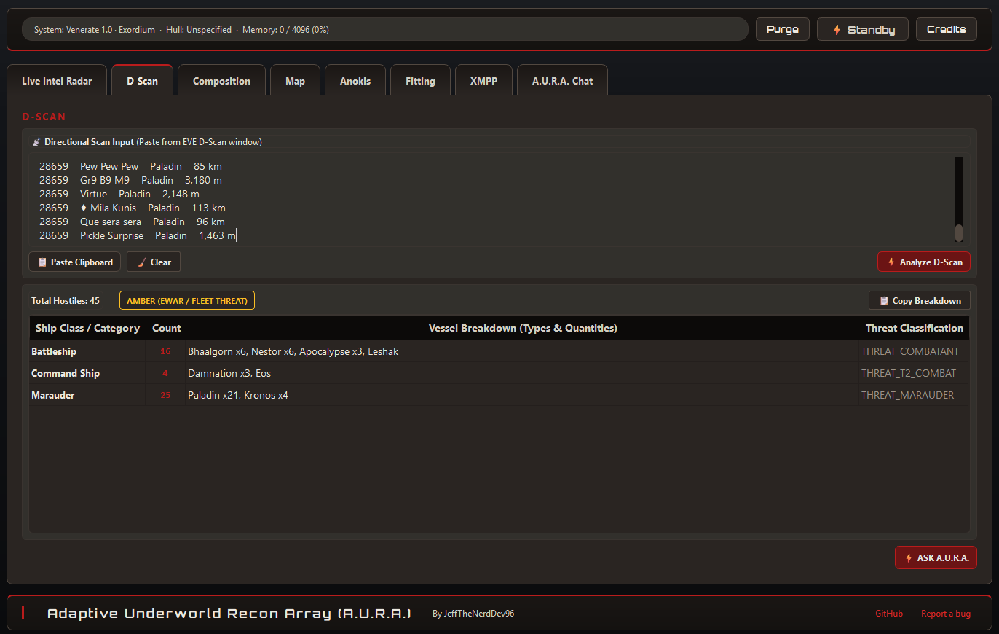

# Adaptive Underworld Recon Array (A.U.R.A.)

**v0.5.0-alpha.1** — unofficial New Eden tactical companion. Designed with an offline-first architecture: A.U.R.A. **can be used as an offline-only app** with local neural reasoning, local log tailing, and offline stargate graphs, with optional opt-in network connectivity for Alliance XMPP communications. No cloud telemetry.

**EVE Online**, the **EVE logo**, and related marks are trademarks of **Fenris Creations** (FC Games / formerly CCP Games / CCP hf). All rights are reserved worldwide. All other trademarks are the property of their respective owners. EVE Online, the EVE logo, and all associated logos, designs, artwork, screenshots, character models, hulls, storylines, world lore, and game mechanics are the intellectual property of Fenris Creations.

A.U.R.A. is an unofficial, community-developed, fan-made tactical companion. It is **not** affiliated with, endorsed by, sponsored by, or operated in partnership with **Fenris Creations**, **FC Games**, or their affiliates.

---

LINUX EDITION - https://github.com/JeffTheNerdDev96/A.U.R.A.-eve-tool-linux

---

## Tabs/Features

A.U.R.A. organizes its tactical suite into eight specialized desktop tabs:

1. **Live Intel Radar** — Real-time chat log and game log tailer featuring heuristic threat classification (CLEAR to CRITICAL), hop-range proximity rings, and automated tactical responses.
2. **D-Scan** *(EXPERIMENTAL)* — Dedicated Directional Scan analyzer with automatic ship class grouping, itemized vessel quantities (`Class : Count : Specific Ships xQty`), and on-demand "Ask A.U.R.A." tactical handovers.
3. **Composition** — Friendly fleet composition vs. hostile fleet analyzer. Includes multi-role breakdowns (Logistics, Interdictors/Tackle, Strategic Cruisers, Mainline DPS, T2 Recons / EAS, Covert Ops) and local matchup heuristics.
4. **Map** — Interactive stargate bubble graph centered on your current solar system, complete with intel threat overlays, BFS route planning, and custom system avoidance.
5. **Anokis** *(EXPERIMENTAL)* — Wormhole chain mapping for Anoikis J-space: interactive topology hierarchies, system class badges (C1–C6, Thera, Pochven, K-space), mass/lifetime decay tracking (including remaining-time prune), and cosmic signature management via EVE probe scanner clipboard ingestion.
6. **Fitting** *(EXPERIMENTAL)* — Fitting Lab and EFT import/export with visual slot layouts, heuristic CPU/PG/EHP from the local ship/module database (`core/eve_data.py`), Dogma hardpoint limits, single-module constraint enforcement, and "Ask A.U.R.A." role evaluations.
7. **XMPP** *(EXPERIMENTAL)* — Alliance tactical messaging and broadcast ping receiver (`xmpp_chat`). Features real-time MUC broadcast channel monitoring, ping urgency classification (CTA, StratOp, Formup), roster DMs, server room directory, and one-click tactical handover to A.U.R.A. Chat.  
   * *Security Notice:* XMPP credentials exist strictly in volatile memory for the active session and are **never saved to disk or configuration files**.
8. **A.U.R.A. Chat** *(EXPERIMENTAL)* — Local GGUF neural reasoning core powered by `llama.cpp`. Serves as an onboard tactical assistant for combat briefings, live telemetry snapshots, document parsing, and screenshot OCR. The installer bundles **Phi-4 Mini (4-bit Q4_K_M)** for local execution. A custom tactical fine-tune (`AURA-Eve-Tactical-Instruct-3.8B`) is planned and is **not** the runtime default.

> **Note:** Experimental tabs currently have limited backend integration. **Fitting** uses heuristic (not full live Dogma) stats from the bundled ship and module database. **A.U.R.A. Chat** runs Phi-4 Mini for local briefings ahead of custom model deployment.

User operations: [USER_GUIDE.md](USER_GUIDE.md). Code internals & architecture: [DEVELOPER.md](DEVELOPER.md). Security & privacy policy: [SECURITY.md](SECURITY.md). Legal terms & disclaimers: [LEGAL.md](LEGAL.md). Release notes: [CHANGELOG.md](CHANGELOG.md).

---

## Screenshots

Operations captions live in [USER_GUIDE.md](USER_GUIDE.md). Tab order matches the app:

<table>
<tr>
<td align="center"><b>Live Intel Radar</b><br></td>
<td align="center"><b>D-Scan</b><br></td>
</tr>
<tr>
<td align="center"><b>Composition</b><br></td>
<td align="center"><b>Map</b><br></td>
</tr>
<tr>
<td align="center"><b>Anokis</b><br></td>
<td align="center"><b>Fitting</b><br></td>
</tr>
<tr>
<td align="center"><b>XMPP</b><br></td>
<td align="center"><b>A.U.R.A. Chat</b><br></td>
</tr>
</table>

---

## Offline-First Architecture

A.U.R.A. is engineered so that it **can be used as an offline-only app**:
* **Local Neural Inference:** Large language models run entirely locally via CPU, NVIDIA CUDA, AMD Vulkan, or Intel NPU coprocessors. Zero prompts or chat histories are sent to remote APIs.
* **Offline SDE Database:** Solar systems, stargates, ship hulls, and dogma attributes are bundled locally in `eve_map.json` and `core/eve_data.py`.
* **Passive Local Log Tailing:** Intel feeds read standard client text logs directly from disk.
* **Opt-In External Connectivity:** Outbound network connections are strictly opt-in and restricted to user-configured Alliance XMPP servers. If not configured, the app operates completely offline in closed local compute mode.

---

## Running A.U.R.A.

```bash
git clone https://github.com/JeffTheNerdDev96/A.U.R.A-eve-tool.git
cd A.U.R.A-eve-tool
```

1. `A.U.R.A. Source/requirements/install_auto.bat` (or a named hardware script in that folder).
2. `run.bat`

Standalone: `AURA_Setup_v0.5.0-alpha.1.exe` (bundled Python 3.12 and model weights).

Details on hardware profiles and co-processors: [requirements/README.md](A.U.R.A.%20Source/requirements/README.md).

---

## Credits & Attributions

Full attributions: [CREDITS.md](CREDITS.md) and the **Credits** modal in the application.

Inspired by [RIFT](https://riftforeve.online), [PYFA](https://github.com/pyfa-org/Pyfa), and [dscan.info](https://dscan.info). Map data from [Fuzzwork](https://www.fuzzwork.co.uk). XMPP protocol specifications by the XMPP Standards Foundation (XSF). EVE Online is intellectual property of Fenris Creations / CCP Games.

---

## License

Adaptive Underworld Recon Array (A.U.R.A.) is free and open-source software distributed under the terms of the **[GNU Affero General Public License Version 3 (AGPL-3.0)](LICENSE.txt)**.
