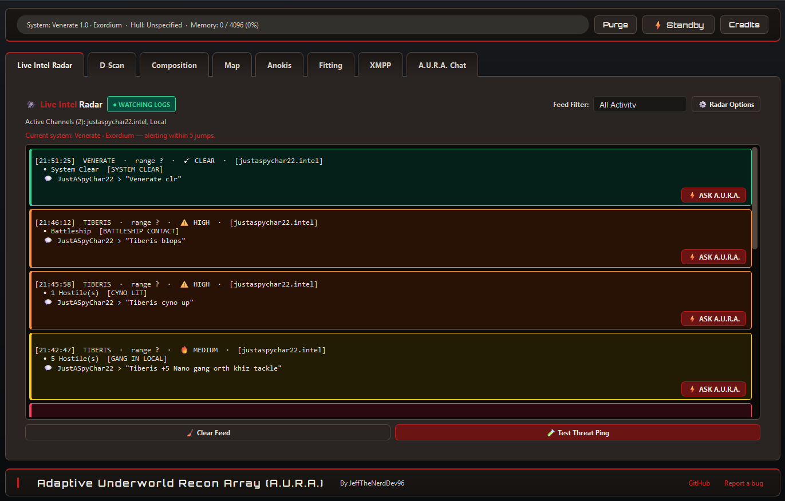
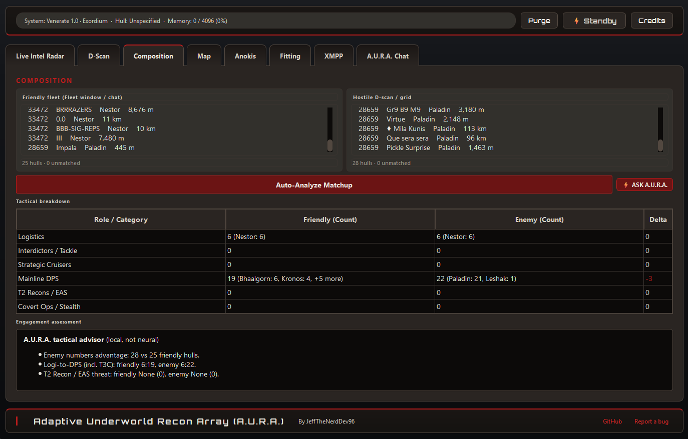
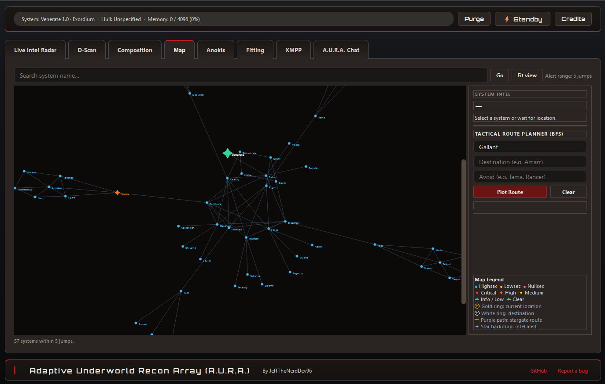
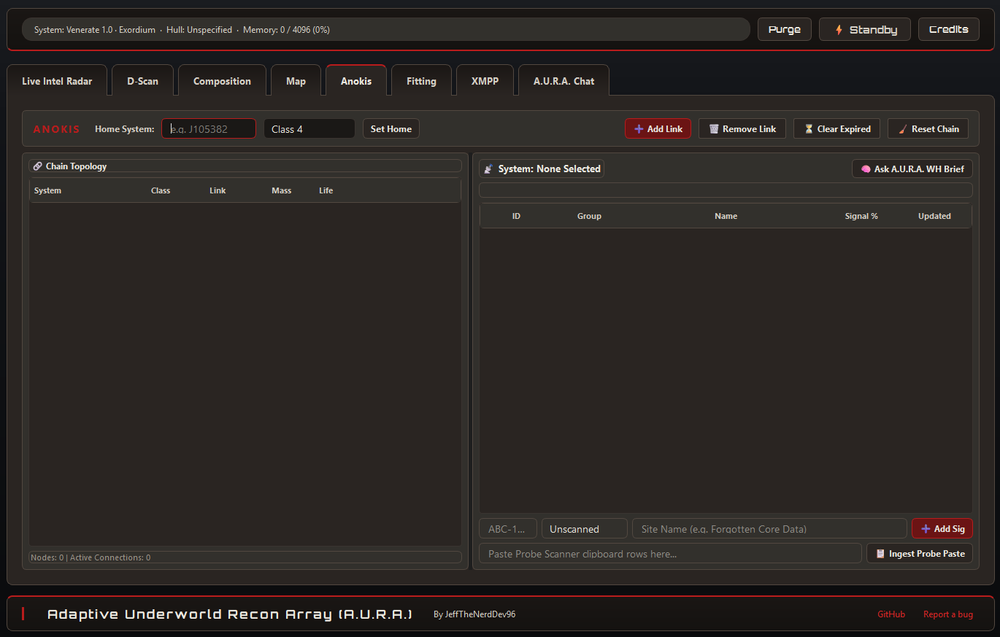
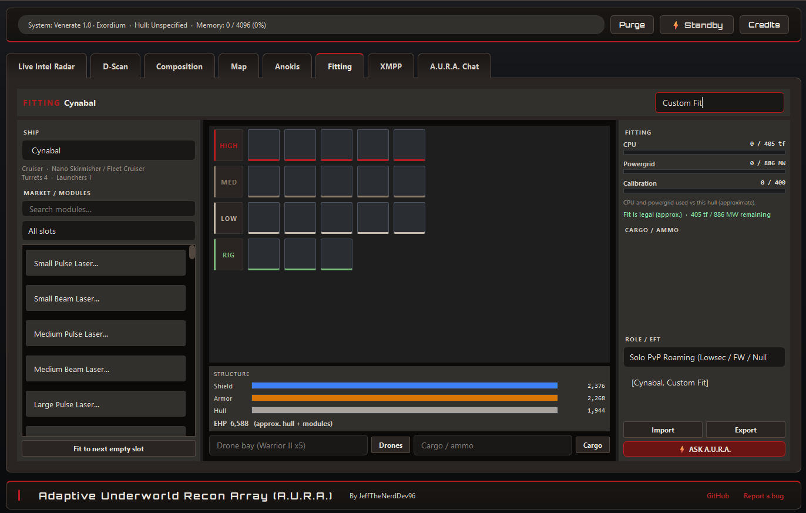
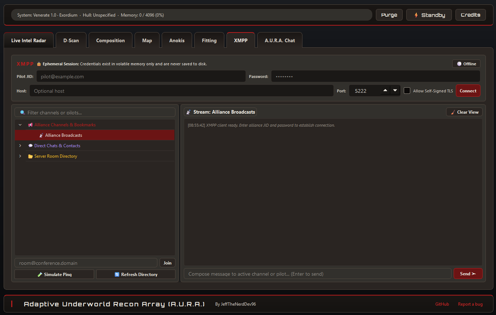
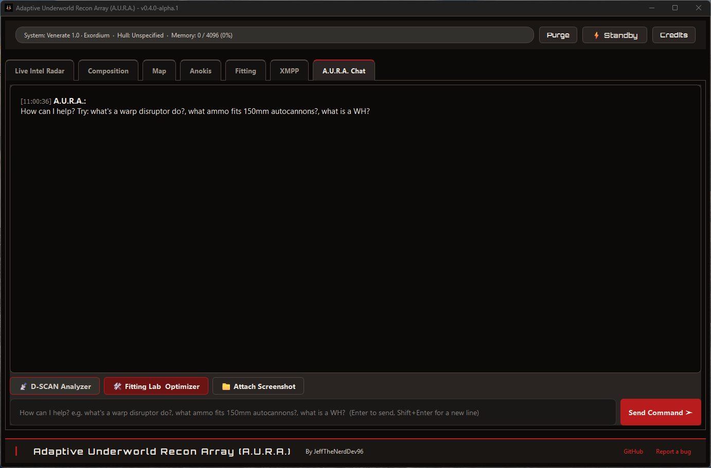

# Adaptive Underworld Recon Array (A.U.R.A.) — v0.5.0-alpha.1 — User Guide

**Adaptive Underworld Recon Array (A.U.R.A.)**  
*v0.5.0-alpha.1*  
*Angel Cartel Cybernetics Division — by JeffTheNerdDev96*

Not affiliated with or endorsed by CCP Games / Fenris Creations. EVE Online is a trademark of CCP / Fenris Creations.

---

## 1. Overview

A.U.R.A. is an **offline-first Windows companion** for EVE Online (Linux/Proton users: see the [Linux edition](https://github.com/JeffTheNerdDev96/A.U.R.A.-eve-tool-linux)). It tails local **Chatlogs** and **Gamelogs** on disk, parses clipboard **pastes** (intel, D-scan, fleet rosters, EFT, probe scanner), renders **stargate bubble graphs** from a bundled map snapshot, provides **wormhole chain topology and signature tracking**, integrates **Alliance XMPP tactical communications**, and provides onboard AI reasoning via a local **Phi-4 Mini 4-bit GGUF** (`llama.cpp`). There is no cloud telemetry at runtime.

### What it is

- An unofficial, offline-first tactical helper while you fly New Eden.
- Designed with local architecture: **A.U.R.A. can be used as an offline-only app** without internet access.
- Eight tabs arranged in operational sequence:
  1. **Live Intel Radar** — Log tailer, threat classification, and proximity hop rings
  2. **D-Scan** *(experimental)* — Dedicated Directional Scan analyzer with class grouping
  3. **Composition** — Friendly fleet vs hostile D-scan matchup analysis
  4. **Map** — Stargate bubble graph around your current solar system
  5. **Anokis** *(experimental)* — Anoikis J-space chain mapping, mass/life decay, and cosmic signature tracker
  6. **Fitting** *(experimental)* — Fitting Lab, EFT import/export, and role evaluation
  7. **XMPP** *(experimental)* — Alliance broadcast ping stream and MUC channel listener (ephemeral session)
  8. **A.U.R.A. Chat** *(experimental)* — Local GGUF neural core for tactical briefings and OCR ingestion
- Background log monitoring continues seamlessly regardless of which tab is active.

### What it is not

- Not a CCP / Fenris Creations product, overlay, or in-client injection tool.
- No ESI / SSO login, no reading of game memory (RAM), and no packet interception.
- No live zKill, DOTLAN, or market server queries.
- Not a market trader, not a bot, and contains zero automation/macro harnesses.
- XMPP credentials exist **in-memory for the active session only**. To preserve operational security, A.U.R.A. **never saves XMPP passwords or JIDs to disk**.

---

## 2. Window Chrome & Controls

- **Top Bar:** Current system (with security status & region once known), piloted hull grounding, context memory allocation, **Purge** action, live hardware status badge (Online / Standby), and **Credits**.
- **Tab Strip:** `Live Intel Radar` → `D-Scan` → `Composition` → `Map` → `Anokis` → `Fitting` → `XMPP` → `A.U.R.A. Chat`.
- **Footer:** Angel Cartel brand mark, author attribution, GitHub repository link, and issue reporting.
- **System Tray:** Minimize-to-tray capability with optional Windows threat notifications.

**Purge:** Instantly halts neural token generation, unloads the local GGUF model from VRAM/RAM, purges conversation history, wipes attachments, and clears ephemeral session memory.

**Inactivity Standby:** After **5 minutes** of inactivity (no user input and no active generation), the local model automatically unloads to free GPU/CPU resources. The next prompt re-arms the core on demand.

---

## 3. Live Intel Radar

Tails local EVE log files, classifies incoming intel lines with heuristic regex patterns, and displays cards ranked by hop distance from your current system.

### Capabilities & Controls

- **Auto-Discovery:** Automatically locates EVE Chatlogs (`Documents\EVE\logs\Chatlogs`, OneDrive, Saved Games, Steam Proton prefixes) and sibling Gamelogs.
- **Active System Tracking:** Monitors `Local` chat logs and `Gamelogs` for system transitions (`Connecting to …`, `Jumping from X to Y`, `local changed to …`).
- **Radar Options:** Opens the options dialog for log folder, channel filters, character tracker, hop radius, Windows alerts, hide-clears, and auto-respond. There is no separate Settings window — chatlog folder selection lives here (**Browse Folder**).
- **Character Tracker:** Choose which logged-in character's Local / Gamelog stream drives your current-system location.
- **Channel Filters:** Filter log streams by Intel Channels, Custom Keywords, All Channels, Alliance Only, Corp Only, or Local Only.
- **Proximity Alerts:** Configurable hop radius (**0–20 jumps**, default **5**), shared dynamically with the Stargate Map bubble. **Show in-range only** hides cards outside that radius.
- **Windows Threat Alerts:** Desktop toast notifications for MEDIUM, HIGH, or CRITICAL hostiles entering your defined jump radius (~20s debounce).
- **Feed Filters:** Filter cards by All Activity, Exclude Clears, Medium+, High+, or Critical, plus **Hide System Clear (CLR)**.
- **Automated Response:** Optional **Auto-Respond to Critical Threats** triggers immediate tactical AI briefings for hostile cynos, bubbles, or capital drops.
- **Clear Feed / Test Threat Ping:** Wipe the visible card stack, or inject a synthetic ping to verify alerts and toast plumbing.

---

## 4. D-Scan
## EXPERIMENTAL/IN DEV FEATURE

 Analysis")

Dedicated Directional Scan analyzer (`subsystems/dscan`). Paste from the in-game D-Scan window; the tab groups ships by class with itemized vessel quantities.

- **Paste Clipboard / Clear:** Pull the current clipboard, or wipe the input and breakdown table.
- **Analyze D-Scan:** Parses the paste (also runs automatically when text is present). Output columns: Ship Class / Category, Count, Vessel Breakdown (`Class : Count : Specific Ships xQty`), Threat Classification.
- **Copy Breakdown:** Copies the grouped summary to the clipboard.
- **Ask A.U.R.A.:** Hands the current breakdown to A.U.R.A. Chat for a combat briefing.
- Chat input on the Chat tab also auto-detects D-Scan vs EFT pastes.

---

## 5. Composition

Dual-pane fleet analysis comparing your friendly fleet composition against a hostile Directional Scan (D-Scan) snapshot.

- **Six-Role Classification:** Evaluates fleet rosters across **Logistics**, **Interdictors/Tackle**, **Strategic Cruisers**, **Mainline DPS**, **T2 Recons / EAS**, and **Covert Ops**.
- **Matchup Assessment:** Instant local heuristic evaluation of alpha strike risks, rep sustainability, and electronic warfare vulnerabilities (no LLM required).
- **Ask A.U.R.A.:** One-click button to dispatch the matchup comparison to A.U.R.A. Chat for a deep tactical doctrine breakdown.

---

## 6. Map

Interactive stargate neighborhood bubble centered on your current solar system.

- **Search / Go / Fit view:** Jump the graph to a named system and re-fit the viewport to the visible neighborhood (capped at 250 nodes).
- **BFS Pathfinding:** Built-in breadth-first routing engine utilizing bundled offline graph data (`data/eve_map.json`). **Plot Route** from Origin to Destination; **Clear** resets the path.
- **Avoidance Routing:** Add dangerous systems to the **Avoid** list to calculate detour routes around camped choke points.
- **Intel Rings:** Hostile intel reports illuminate systems on the map with color-coded threat rings (Red: Critical, Orange: High, Yellow: Medium, Cyan: Info, Green: Clear). Map overlays prune after about 10 minutes.
- **Security Coloring:** High, low, and nullsec nodes use distinct security-status colors; the legend also marks current location, destination, plotted route, and intel backdrop.

---

## 7. Anokis (Wormhole Chain & Signature Tracker)
## EXPERIMENTAL/IN DEV FEATURE

Dedicated tactical management tab for Anoikis J-space exploration, chain mapping, and cosmic signature tracking.

### Chain Topology Management

- **Home System Configuration:** Set your home J-space system (e.g. `J105382`) with wormhole class classification (**C1–C6, Thera, Pochven, High/Low/Null**) and environmental effects (**Wolf-Rayet, Pulsar, Magnetar, Cataclysmic Variable, Red Giant, Black Hole**).
- **Add / Remove Link:** Link child systems with connection codes (e.g. `K162`, `D845`, `N432`, `Z988`), mass stage (**Fresh / Stage 1 >50%**, **Destab / Stage 2 10%–50%**, **Critical <10%**, **Verge of Collapse**), and lifetime decay (**Stable**, **End of Life <4h**, **Critical**). Remaining-time countdowns display when an expiry is known (e.g. `Stable (12h 04m)`, `EOL (3h 12m)`, `EXPIRED`).
- **Clear Expired:** Prune dead holes whose lifetime has elapsed.
- **Reset Chain:** Wipe the entire topology and start over.
- **Visual Node Tree:** Hierarchical explorer showing depth, leading hole type, and connection decay status.

### Cosmic Signature Manager

- **Signature Table:** Real-time tracking of active signatures in the selected system: Sig ID (`ABC-123`), Group (Wormhole, Relic, Data, Gas, Combat), Name, Signal Strength (%), and Timestamp.
- **Probe Scanner Ingestion:** Copy rows directly from the in-game Probe Scanner (`Ctrl+A` → `Ctrl+C`) and click **Ingest Probe Paste** to automatically extract signature IDs, groups, and scan percentages.
- **Ask A.U.R.A. WH Brief:** Request an instant local neural briefing summarizing chain hazards, hole stability, and site recommendations.

---

## 8. Fitting (Fitting Lab)
## EXPERIMENTAL/IN DEV FEATURE

Visual EFT fitting lab and role evaluation console on a **single tab** (there is no separate optimizer window). Stats are heuristic estimates from the local ship/module database (`core/eve_data.py`), not a full live Dogma simulator.

- **Hull Picker & Paperdoll:** Choose a hull; slot counts, turret/launcher hardpoints, CPU, powergrid, and calibration follow the selected ship.
- **EFT Ingestion:** **Import** / paste ship fits in standard EFT block format (`[Hull, Fit Name]`). **Export** copies the current fit back out.
- **Visual Slot Layout:** Categorizes modules into High, Medium, Low, Rig, and Subsystem racks. Cargo / ammo and drone bay are shown alongside HP bars.
- **Hardpoint & Single-Fit Rules:** Enforces turret/launcher hardpoint limits and single-fit groups (for example Damage Control, Ancillary Armor Repairer).
- **Attribute Estimation:** Heuristic calculations for baseline Effective HP (EHP), CPU/Powergrid/calibration load, and module sizing validity.
- **Role Evaluation:** Submit fits via **Ask A.U.R.A.** for role-based review against intended combat doctrines (Solo PvP, Small Gang, Nano Kiting, Abyssal Deadspace, Fleet Anchor, WH Combat, and related presets).

---

## 9. XMPP (Alliance Tactical Messaging & Fleet Pings)
## EXPERIMENTAL/IN DEV FEATURE

Dedicated out-of-game tactical communications tab (`subsystems/xmpp_chat`) for monitoring alliance broadcast channels, fleet pings, roster DMs, and coalition operations.

### Ephemeral Security Architecture

> [!IMPORTANT]
> **Zero Disk Credential Persistence**:
> For operational security (OpSec), **XMPP logins and passwords are NEVER saved to disk, configuration files, or the OS registry**. Authentication credentials exist strictly in volatile memory for the active session and are wiped immediately upon disconnect, purge, or application exit.

### Connecting to Alliance XMPP Servers

1. Enter your pilot JID (e.g. `pilot@goonfleet.com` or `user@xmpp.pandemic-horde.org`) and alliance password.
2. **Host Override:** Many New Eden alliance domains do not configure standard DNS SRV records. If your alliance uses a dedicated relay host (e.g. `xmpp.domain.com`), enter it in the **Host** field.
3. **Port & TLS:** Standard STARTTLS runs on port `5222`; Direct TLS runs on port `5223`. Enable **Allow Self-Signed TLS** if your alliance infrastructure utilizes internal private CA certificates.
4. Click **Connect** to initialize the secure XMPP Client session.

### Multi-User Chat, Directory, DMs & Broadcast Alert Stream

- **Room Navigation:** Browse joined MUC rooms and broadcast channels (e.g. `#broadcasts`, `#fleets`, `#op-chat`) in the left sidebar.
- **Server Room Directory:** Discover published MUC rooms on the connected host (**Refresh Directory**).
- **Roster DMs:** Direct chats with roster contacts; in-app `opendm:` links open a DM pane without leaving A.U.R.A.
- **Alliance Fleet Pings:** Broadcast messages are automatically highlighted with glowing urgency borders:
  - CTA / Max Numbers: High-priority red callout
  - StratOp / Objective: Orange strategic operation alert
  - Fleet Formup: Cyan formup notification
- **Extracted Tactical Telemetry:** Broadcast bots are parsed for FC names, staging locations, and doctrine ships.
- **Ask A.U.R.A. Handover:** Click **Ask A.U.R.A.** on any incoming fleet ping (or follow an `ask_aura:` link) to analyze required doctrine fits and target routing in A.U.R.A. Chat. External link clicks are restricted to `http` / `https`.

---

## 10. A.U.R.A. Chat (Local Neural Core)
## EXPERIMENTAL/IN DEV FEATURE

Local tactical AI assistant running quantized GGUF weights via `llama.cpp`. The bundled runtime is **Phi-4 Mini (Q4_K_M)**; a custom tactical fine-tune is planned and is **not** the default loaded model.

- **Onboard Reasoning:** Ask questions about New Eden ship mechanics, damage types, module interactions, and combat tactics.
- **Live Telemetry Snapshot:** Each prompt can include current system, active fit header, Anokis chain summary, and top radar threats so briefings stay grounded in the session.
- **Document & Image Ingestion:** Attach killmail screenshots, battle briefs, or EFT files (`PNG`, `JPG`, `PDF`, `DOCX`, `TXT`, `CSV`; 8 MB cap).
- **Windows Media OCR:** Hardware-accelerated local optical character recognition extracts text from attached screenshots without cloud API calls.
- **Stop Generation:** Interrupt an in-flight token stream immediately. **Purge** also stops generation and unloads the model.

---

## 11. Hardware Profiles & Installation

A.U.R.A. utilizes hardware-specific install scripts located in `A.U.R.A. Source/requirements/`:

| Script | Target Hardware Architecture |
|---|---|
| `install_auto.bat` | Automatic hardware probe & optimal profile selection |
| `install_nvidia_cuda.bat` | NVIDIA Dedicated GPU (GeForce RTX 20/30/40, CUDA 12.4+) |
| `install_amd_dgpu.bat` | AMD Dedicated GPU (Radeon RX 6000/7000, Vulkan 1.3) |
| `install_amd_igpu.bat` | AMD Integrated GPU (Radeon 780M/890M, Vulkan 1.3) |
| `install_amd_npu.bat` | AMD Ryzen AI NPU (XDNA Coprocessor, DirectML) |
| `install_intel_dgpu.bat` | Intel Dedicated GPU (Intel Arc A-Series, OpenVINO / Vulkan) |
| `install_intel_igpu.bat` | Intel Integrated GPU (Iris Xe / Intel Arc Graphics) |
| `install_intel_npu.bat` | Intel NPU (AI Boost Level Zero Coprocessor) |
| `install_cpu.bat` | Standard Multi-Core CPU (SIMD AVX2 / AVX-512 Vector Mesh) |

Launch the application via `run.bat` in the repository root or through the standalone package `AURA_Setup_v0.5.0-alpha.1.exe`.

---

## 12. Troubleshooting & Diagnostic Error Registry (`AURA-ERR-xxxx`)

All diagnostic errors are logged to `logs/crash.log`:

| Error Code | Domain | Resolution |
|---|---|---|
| **`AURA-ERR-1001`** | Neural Weights Missing | Place `model_q4.gguf` in `models/phi-4-mini/` or run the standalone installer. |
| **`AURA-ERR-1002`** | Context Alloc Failed | Close memory-heavy background applications or run `install_cpu.bat`. |
| **`AURA-ERR-1003`** | Python Incompatible | Requires Python 3.12 64-bit or higher. |
| **`AURA-ERR-1004`** | Inference Timeout | Verify graphics drivers or switch to CPU vector mode. |
| **`AURA-ERR-2001`** | Intel NPU Failure | Update Intel NPU driver (v32.0.100.3104+) via Intel Driver Assistant. |
| **`AURA-ERR-2002`** | AMD Vulkan Error | Ensure AMD Adrenalin drivers with Vulkan 1.3 support are installed. |
| **`AURA-ERR-2003`** | NVIDIA CUDA Error | Update NVIDIA Game Ready/Studio driver (550.00+) and CUDA toolkit. |
| **`AURA-ERR-2004`** | Hardware Topology Probe | Run with standard user privileges or restart the display driver. |
| **`AURA-ERR-3001`** | D-Scan Parse Failed | Copy raw text from the in-game Directional Scan window (`Ctrl+A` → `Ctrl+C`). |
| **`AURA-ERR-3002`** | Intel Regex Error | Ensure chat logs are UTF-8 or UTF-16 text files as written by EVE Online. |
| **`AURA-ERR-3003`** | EFT Parse Failed | Verify EFT block syntax begins with `[ShipName, FitName]`. |
| **`AURA-ERR-3004`** | Document / OCR Ingestion | Use a supported, unprotected file (`.png`, `.jpg`, `.bmp`, `.txt`, `.pdf`, `.docx`). |
| **`AURA-ERR-4001`** | Chatlogs Dir Missing | Open **Radar Options** on Live Intel Radar and use **Browse Folder** to select your EVE Chatlogs folder. |
| **`AURA-ERR-4002`** | Log Stream Locked | Check file permissions in `Documents/EVE/logs/Chatlogs`. |
| **`AURA-ERR-4003`** | Cache I/O Error | Ensure write permissions exist for the application working directory. |
| **`AURA-ERR-5001`** | Worker Crash | Check `logs/crash.log` for diagnostic traceback. |
| **`AURA-ERR-5002`** | Model Switch Failed | Restart A.U.R.A. to re-arm the desired hardware profile. |
| **`AURA-ERR-5003`** | UI Render Error | Verify display scaling settings or restart the application. |
| **`AURA-ERR-6001`** | WH Topology Cycle | Verify parent and child solar system links in the Anokis tab. |
| **`AURA-ERR-6002`** | Signature Conflict | Verify signature ID format (e.g. `ABC-123`) and uniqueness in system. |
| **`AURA-ERR-7001`** | XMPP Auth Failed | Verify pilot JID, username, and password with your alliance auth service. |
| **`AURA-ERR-7002`** | XMPP TLS Handshake | Check port (5222/5223) and toggle 'Allow Self-Signed TLS' if using internal certs. |
| **`AURA-ERR-7003`** | XMPP Host Unreachable | Check internet connection or provide an explicit server host override. |
| **`AURA-ERR-7004`** | XMPP MUC Join Failed | Verify room JID syntax (e.g. `broadcasts@conference.domain.com`) and room permissions. |

---

## 13. Linux, Steam Deck & Proton Compatibility

Native Linux packaging lives in a **separate repository**: [A.U.R.A.-eve-tool-linux](https://github.com/JeffTheNerdDev96/A.U.R.A.-eve-tool-linux). This Windows tree can still be run under **Valve Proton**, GE-Proton, Proton Experimental, or a standard Wine prefix.

1. **Standalone Installation:** Run `AURA_Setup_v0.5.0-alpha.1.exe` via Proton, or copy the application folder to your Linux drive.
2. **Add Non-Steam Game:** In Steam, click **Add a Non-Steam Game** and point at the installed Windows executable (or `run.bat` / `Launch_A.U.R.A_Debug.bat` from a source checkout). Prefer the Linux edition repo when you want a native launcher.
3. **Compatibility:** Under shortcut Properties → **Compatibility** → select **Proton 11** or Proton Experimental.
4. **Chatlog Auto-Discovery:** Steam installations auto-discover the EVE Online log directory under:
   `~/.steam/steam/steamapps/compatdata/8500/pfx/drive_c/users/steamuser/Documents/EVE/logs/Chatlogs`
5. **Vulkan Compute:** Hardware acceleration passes directly through Proton's `vulkan-1.dll` to host Mesa RADV or NVIDIA drivers.
