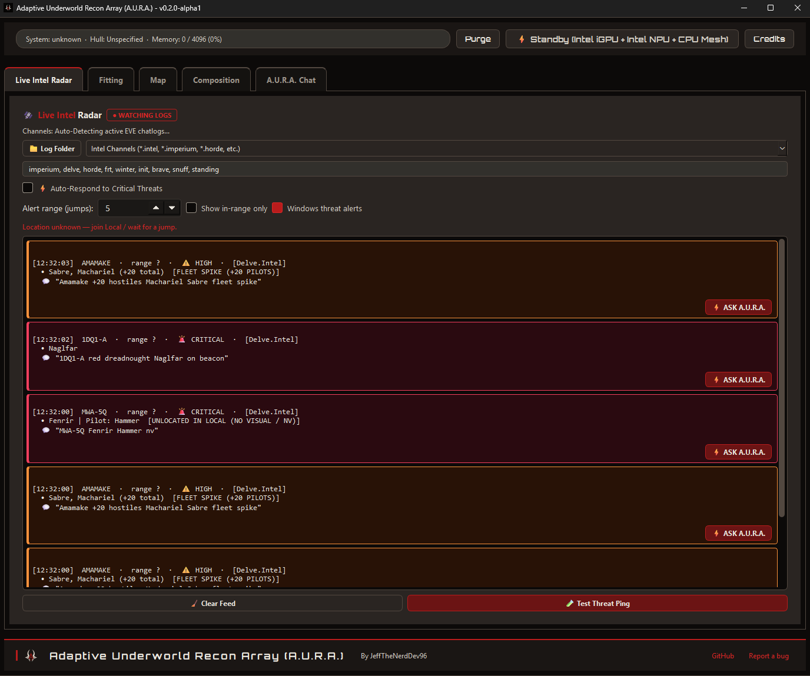
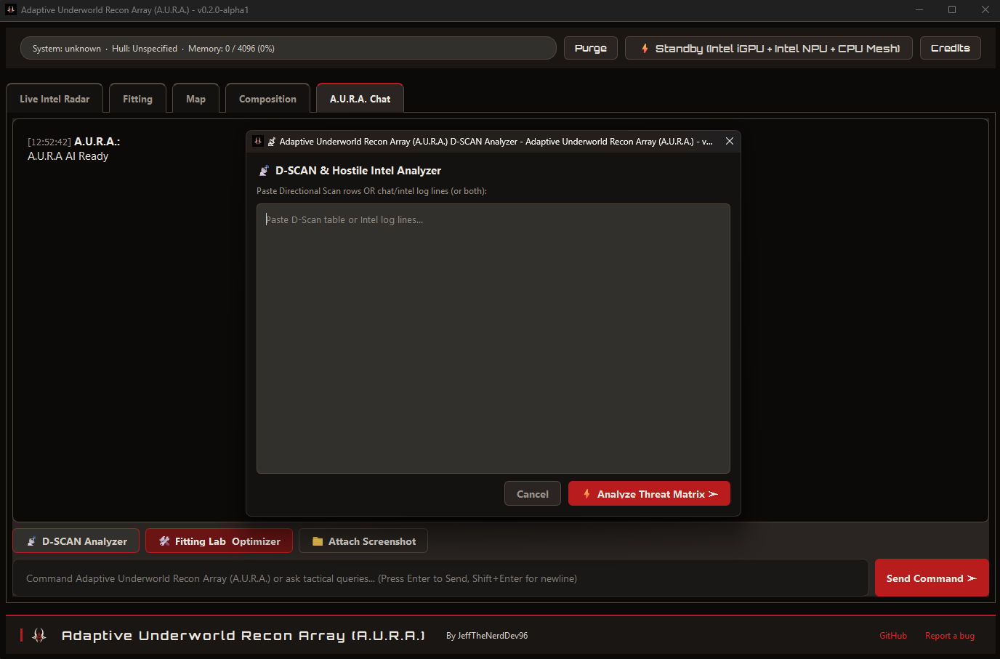
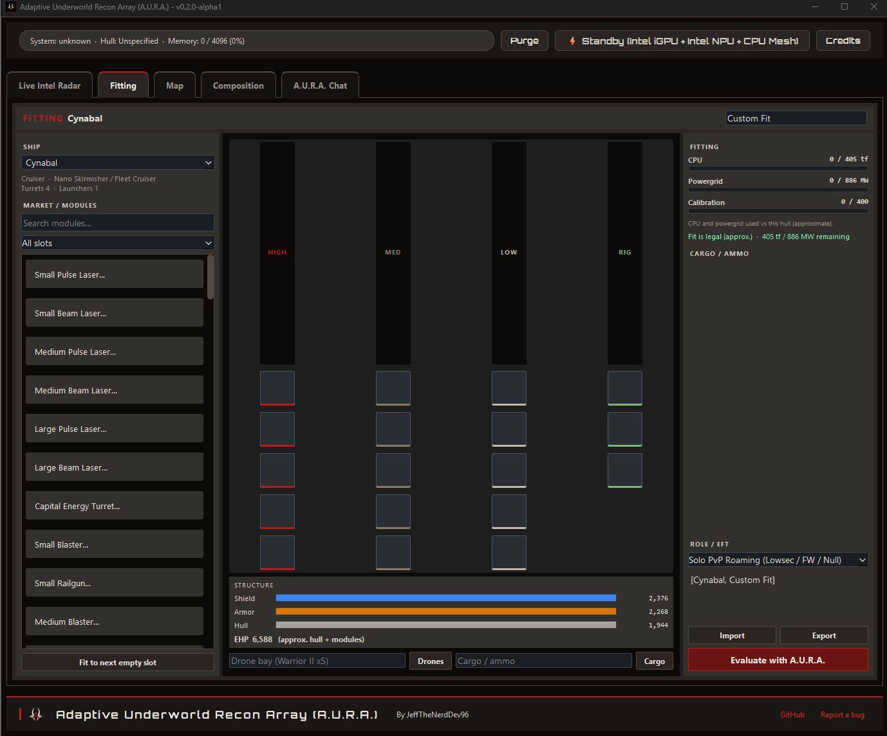
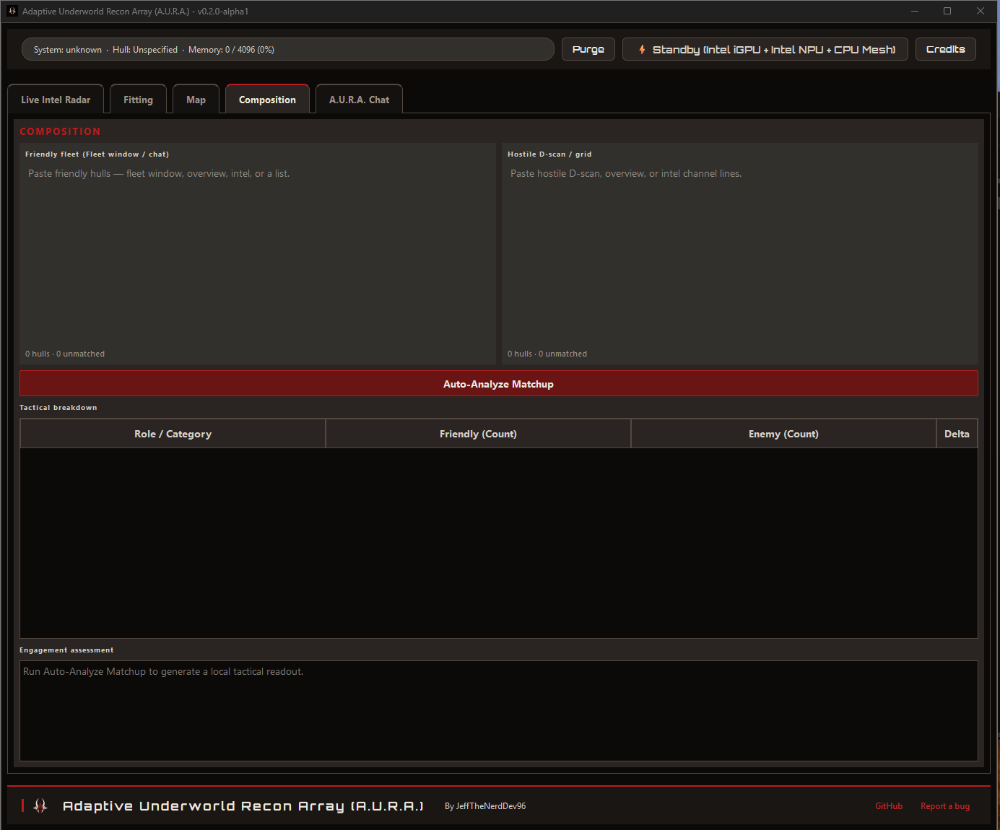
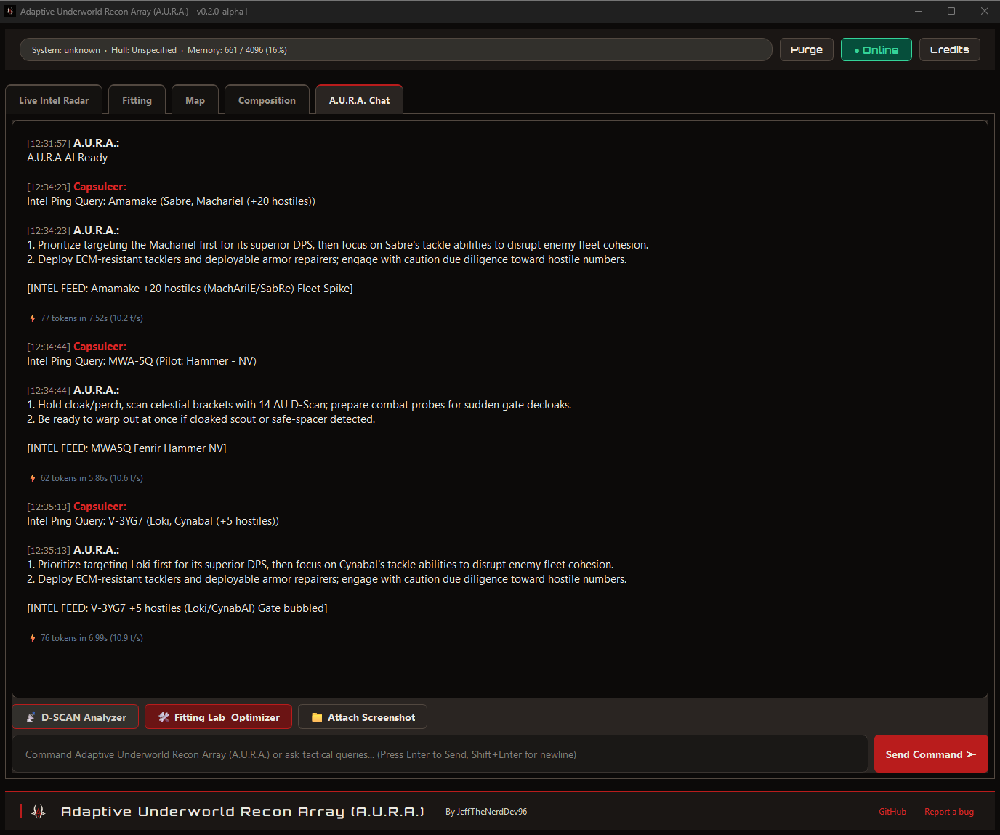

# Adaptive Underworld Recon Array (A.U.R.A.) — v0.2.1-alpha2 — Tactical User Guide

**Adaptive Underworld Recon Array (A.U.R.A.)**  
*Angel Cartel Cybernetics Division — by JeffTheNerdDev96*

---

## 1. Overview & Mission

A.U.R.A. is an offline-first, tactical intelligence co-pilot designed for EVE Online capsuleers. Powered by an onboard **Phi-4 Mini (3.8B Reasoning)** neural core and multi-hardware parallel compute mesh (supporting Intel AI Boost NPUs, NVIDIA CUDA, AMD Vulkan / Ryzen AI, and CPU vector compute), A.U.R.A. provides:
- Instant tactical combat analysis & counter-play
- Directional scan (D-Scan) fleet threat ranking
- Fleet vs hostile composition matchup (local rule-based assessment)
- Ship fitting validation & doctrine reviews (EFT format)
- Tactical stargate map with intel overlays
- Visual OCR & document ingestion (screenshots, killmails)
- Real-time live intel radar monitoring with zero cloud latency or external telemetry

---

## 2. Hardware Architecture & Parallel Mesh Compute

A.U.R.A. automatically discovers and orchestrates host compute topology across:

- **NPU (Neural Processing Unit)**:
  - Intel AI Boost (OpenVINO Level Zero)
  - AMD Ryzen AI XDNA / XDNA 2 (DirectML & NPU Coprocessor)
- **GPU (Graphics Processing Unit)**:
  - NVIDIA GeForce / RTX Dedicated GPUs (CUDA acceleration)
  - AMD Radeon RX & Radeon 680M/780M/890M iGPUs (Vulkan)
  - Intel Arc Dedicated & Iris Xe / UHD Integrated Graphics
- **Multi-Threaded CPU Vector Mesh**:
  - Dynamically utilizes all available physical cores and logical threads.

### Parallel Workload Scaling
A.U.R.A. engages host compute concurrently: offloading 33 neural layers to GPU VRAM, utilizing full multi-core CPU vector threads, and running asynchronous tensor evaluation on the NPU co-processor.

---

## 3. Combat Systems & Modules

### Workspace Tabs
The main window uses five tabs. Live intel monitoring continues in the background on every tab:

**Live Intel Radar → Fitting → Map → Composition → A.U.R.A. Chat**

- **Live Intel Radar** — live intel feed, channel filters, jump-range alerts
- **Fitting** — visual slot builder (import/export EFT, then Evaluate with A.U.R.A.)
- **Map** — tactical stargate bubble around your current system with intel overlays
- **Composition** — friendly fleet vs hostile D-scan matchup (local analysis)
- **A.U.R.A. Chat** — tactical assistant, D-Scan paste, attachments

### Live Intel Radar & Threat Tiers

- **Automatic Log Discovery**: Monitors active EVE Online chat logs in:
  `%USERPROFILE%\Documents\EVE\logs\Chatlogs`
- **Current System**: Always tails Local (Channel ID = solarSystemID, `local changed to …`, `Connecting to …`) and Gamelogs (`Jumping from X to Y`). The header shows your system once it is known.
- **5-Jump Alerts**: Intel systems are matched against the bundled stargate map. MEDIUM+ threats within the configured hop count (default 5) raise a **Windows notification**. Out-of-range cards stay in the feed (dimmed) unless **Show in-range only** is checked. Alerts stay silent until location is known.
- **Threat Level Hierarchy**:
  - **CRITICAL**: Capital class vessels (Titan, Supercarrier, Dreadnought, FAX, Carrier, Rorqual, Freighter), active Cynos, or fleets > 20 players.
  - **HIGH**: 10 to 20 players, Battleship class fleets (Machariels, Rokhs, Megathrons, Marauders, Black Ops), and warp bubbles on grid.
  - **MEDIUM**: Less than 10 players, or Battlecruiser / Cruiser / Frigate gangs.
  - **INFO**: No visual reports (`nv` / `na`) or less than 3 in system.
  - **CLEAR**: Explicitly stated only when `clear` or `clr` is reported.
- **Alliance Filters**: Pre-configured for major coalitions (The Imperium, Pandemic Horde, WinterCo / FRT, The Initiative, Brave Collective, Snuffed Out).
- **Custom Keywords**: Input arbitrary channel names or keywords to monitor corp or secret ops logs.

### D-Scan Fleet Threat Analyzer

- Paste raw in-game Directional Scan tables (`Ctrl+A`, `Ctrl+C` from EVE client) into **A.U.R.A. Chat** or use the dedicated analyzer dialog from the Intel Radar workflow.
- Parses hundreds of vessels in milliseconds (<3ms for 500 ships).
- Categorizes vessels into Capitals, Battleships, Cruisers, Tackle, Logistics, and Interdictors with threat ranking and counter-play.

### Fitting Lab (in-game style)

- The **Fitting** tab follows the EVE hangar fitter: market list on the left, ship paperdoll and **Shield / Armor / Hull** bars in the center, **CPU / Powergrid / Calibration** plus **Cargo / ammo** on the right.
- Hover a fitted slot for that module's CPU and PG. Cargo and ammo lines (e.g. `Hail S x2480`) appear in the right-panel list.
- Bars go red if CPU, PG, or calibration overflow. Values are **class-baseline approximations** (not full dogma / skills).
- **Import** reads the clipboard (or opens a paste dialog / file picker) — not the live EFT preview box, which is export-only. **Export EFT** writes the current fit. **Evaluate with A.U.R.A.** sends the fit to Chat.

### Tactical Map
- The **Map** tab renders a pan/zoom stargate graph centered on your current system (from Local / Gamelogs).
- Systems within the **alert jump range** (same setting as Live Intel Radar) appear in the bubble; dense regions cap at 250 closest systems with a caption when truncated.
- **Security colors**: blue highsec, orange lowsec, red nullsec. Your location has a gold ring.
- **Intel overlays**: recent intel systems get a colored threat ring (CRITICAL / HIGH / MEDIUM / INFO). Intel-only systems outside the bubble appear at reduced opacity.
- **Search** a system name to pan and select it. **Fit view** resets zoom. Click a node for region, sec, jump count, and latest intel snippet.

### Composition (fleet vs D-scan)

- The **Composition** tab compares your friendly fleet against a hostile D-scan or grid list without using the neural model.
- **Left paste — Friendly fleet:** Fleet window copy, chat lines, comma lists, or `8 Muninn` style hull counts.
- **Right paste — Hostile D-scan / grid:** Standard D-scan table paste, tab-separated rows, or quantity prefixes (`15x Ishtar`).
- Both sides use the same hull parser as D-Scan (`DScanParser`). Unknown lines stay out of the table.
- Click **Auto-Analyze Matchup** to build the tactical breakdown table:

| Column | Content |
| :--- | :--- |
| Role / Category | Logistics, HAC, HIC, Recons/EWAR, Interdictors/Tackle, Command/Links, BC/BS, Capitals, Other combat, Non-combat |
| Friendly (Count) | Total plus hull mix, e.g. `12 (Muninn: 8, Cerberus: 4)` |
| Enemy (Count) | Same format for hostile side |
| Delta | Friendly minus enemy; **Adv** (green) or **Disadv** (red) when `|delta| ≥ 2` or when logi/EWAR counts differ |

- **Logistics bucket** includes T1 cruisers and frigates (Osprey, Scythe, Augoror, Exequror, Bantam, Burst, Inquisitor, Navitas) and T2 logi (Scimitar, Basilisk, etc.).
- **Engagement assessment** (read-only bullets below the table): EWAR threat (High/Medium/Low), logi-to-DPS Favorable/Unfavorable, tackle comparison, hull totals, and optional HAC range line (missile 40–70 km vs gun/drone 10–30 km). This is **local rules only** — it is not sent to A.U.R.A. Chat in v0.2.0-alpha1.
- **Hints** under each paste: `N hulls · M unmatched`. Junk lines are counted as unmatched, not as fake hulls.
- Recommended window size when this tab is active: about **960 × 620**.

### Recon Vision & Document Ingestion
- Attach combat screenshots, killmail overviews, or tactical briefings in **A.U.R.A. Chat**.

- Hardware-accelerated OCR extracts ship names, modules, and combat text.
- **Supported Formats**: `PNG`, `JPG`, `JPEG`, `BMP`, `WEBP`, `PDF`, `DOCX`, `TXT`, `CSV`.

---

## 4. Controls & Shortcuts

| Action | Control |
| :--- | :--- |
| **Send Command** | Type query in the input box and press `Enter` or click **Send Command** |
| **Stop Generation** | Click **Stop** during token generation |
| **Purge Memory** | Click **Purge Memory** in the top bar to reset conversation buffer |
| **Piloted Ship Grounding** | State your ship (e.g. *"I am in a Wolf"* or *"Flying a Loki"*) to ground combat advice |
| **Log Folder Selection** | Click **Log Folder** on the Intel Radar tab to set a custom EVE log directory |
| **Jump Range Alerts** | Set hop count on the Intel Radar tab; enable **Windows threat alerts** |
| **Visual Fitting** | Use the Fitting tab, or **Fitting Lab** on Chat to jump there |
| **Composition analysis** | Paste friendly and hostile lists on the Composition tab, then **Auto-Analyze Matchup** |

---

## 5. Hardware Profile Installation

Run `requirements/install_auto.bat` to detect hardware, or pick a named script in `A.U.R.A. Source/requirements/`. Each script writes `hardware_profile.json`; the engine routes GGUF layers and the coprocessor mesh using that profile **and** live devices.

- **Auto detect / compose**: `requirements/install_auto.bat`
- **Intel NPU**: `requirements/install_intel_npu.bat`
- **AMD Ryzen AI NPU**: `requirements/install_amd_npu.bat`
- **Intel integrated GPU**: `requirements/install_intel_igpu.bat`
- **AMD integrated GPU**: `requirements/install_amd_igpu.bat`
- **NVIDIA dedicated GPU**: `requirements/install_nvidia_cuda.bat`
- **AMD dedicated GPU**: `requirements/install_amd_dgpu.bat`
- **Intel dedicated GPU**: `requirements/install_intel_dgpu.bat`
- **CPU Vector Mesh**: `requirements/install_cpu.bat`

Setup checks for vendor OS drivers and prints official download links; it does not silent-install GPU/NPU drivers.

Launch with `run.bat` in the root folder or `A.U.R.A. Source/run.bat`. Missing Python/deps self-heal via `install_auto.bat`.

Standalone package: `AURA_Setup_v0.2.0-alpha1.exe` (bundled Python 3.12 and model weights).

---

## 6. Heterogeneous Multi-Hardware Scaling

A.U.R.A. scales inference using the **installed hardware profile** intersected with devices that are still present. Chat remains Phi-4 Mini GGUF (llama.cpp). NPU/OpenVINO/DirectML are coprocessor meshes, not a second chat model.

| Scaling Tier | Target Host Configuration | Dynamic Compute Distribution |
| :--- | :--- | :--- |
| **Tier 4: Heterogeneous Quad-Mesh** | NPU + iGPU + Dedicated dGPU + CPU | Offloads prompt tensors to dGPU while routing coprocessor vision/embeddings to NPU & iGPU with CPU thread mesh (`HETERO:NPU,GPU.0,GPU.1,CPU`) |
| **Tier 3: Full Compute Triple-Mesh** | Intel Core Ultra (NPU + Arc iGPU + CPU) or AMD Ryzen AI (XDNA NPU + Radeon iGPU + CPU) | Asynchronously balances neural context across NPU, integrated graphics, and SIMD CPU cores (`AUTO:NPU,GPU,CPU`) |
| **Tier 2: Discrete GPU + CPU Mesh** | NVIDIA RTX (CUDA) or AMD Radeon (Vulkan) + CPU | Offloads up to 33 neural layers to GPU VRAM with full multi-threaded CPU tensor processing |
| **Tier 1: Ambient NPU Core** | Intel AI Boost / AMD Ryzen AI NPU | Zero GPU/CPU overhead for ambient tactical pings and conversational memory |
| **Tier 1: CPU Vector Mesh** | Multi-Core CPU (Intel / AMD) | Parallelizes across all physical and logical cores with AVX2/AVX-512 SIMD vector compute |

---

## 7. Troubleshooting & Diagnostic Error Codes (`AURA-ERR-xxxx`)

If an anomaly occurs during tactical computation, A.U.R.A. presents a standardized diagnostic error code in the UI and writes timestamped stack traces to `logs/crash.log`:

| Error Code | Title | Root Cause & Resolution |
| :--- | :--- | :--- |
| **`AURA-ERR-1001`** | **Neural Weights Missing** | `model_q4.gguf` was not found in `models/phi-4-mini/`. Run `AURA_Setup_v0.2.0-alpha1.exe` to download weights or place the file manually. |
| **`AURA-ERR-1002`** | **Context Allocation Failure** | Host RAM/VRAM was insufficient to allocate KV cache tensors. Close heavy background apps or lower the context window size in Settings. |
| **`AURA-ERR-1003`** | **Incompatible Python Architecture** | The active Python runtime is older than Python 3.12. Install the standalone package or run `AURA_Setup_v0.2.0-alpha1.exe`. |
| **`AURA-ERR-1004`** | **Inference Stream Timeout** | The neural token generator timed out. Check GPU driver stability or switch to CPU Vector Mesh mode. |
| **`AURA-ERR-2001`** | **Intel NPU Coprocessor Failure** | OpenVINO Level Zero driver error. Update Intel NPU Driver (v32.0.100.3104+) via Intel Driver & Support Assistant. |
| **`AURA-ERR-2002`** | **AMD Vulkan / DirectML Error** | Compute shader pipe failure. Ensure latest AMD Adrenalin graphics drivers with Vulkan 1.3 are installed. |
| **`AURA-ERR-2003`** | **NVIDIA CUDA Acceleration Error** | CUDA VRAM allocation failed on NVIDIA GPU. Ensure Game Ready Driver 550.00+ and CUDA 12.4+ are present. |
| **`AURA-ERR-2004`** | **Hardware Topology Probe Error** | Windows Registry display adapter enumeration failed. Ensure standard user read permissions exist. |
| **`AURA-ERR-3001`** | **D-Scan Syntax Parse Error** | Malformed directional scan clipboard data. Copy directly from the in-game D-Scan window (`Ctrl+A` -> `Ctrl+C`). |
| **`AURA-ERR-3002`** | **Intel Log Parsing Error** | Chat log line decoding error. Ensure EVE Online chat logs are standard UTF-8/UTF-16. |
| **`AURA-ERR-3003`** | **EFT Fitting Format Error** | EFT format syntax error. Ensure fitting begins with `[ShipName, FitName]` followed by slot modules. |
| **`AURA-ERR-3004`** | **Document / Vision Ingestion Error** | Failed to process uploaded image or document. Verify file format (`.png`, `.jpg`, `.pdf`, `.docx`, `.txt`). |
| **`AURA-ERR-4001`** | **Chat Logs Directory Missing** | EVE Chatlogs folder not found in `Documents/EVE/logs/Chatlogs`. Select folder manually via the **Log Folder** button. |
| **`AURA-ERR-4002`** | **Chat Log Stream Lock Error** | Active log file handle is locked by another process. Verify permissions in `Documents/EVE/logs/Chatlogs`. |
| **`AURA-ERR-4003`** | **Tactical Memory Cache Error** | Conversation memory cache file I/O error. Verify write permissions for the application folder. |
| **`AURA-ERR-5001`** | **Worker Thread Fault** | Background inference thread encountered an unhandled exception. Inspect `logs/crash.log` for full traceback. |
| **`AURA-ERR-5002`** | **Model Switch Failure** | Dynamic hardware backend switch timed out. Restart A.U.R.A. to re-arm the desired hardware profile. |
| **`AURA-ERR-5003`** | **UI Tactical Rendering Error** | Qt6 graphical component rendering failed. Check display DPI scaling settings. |

---

## 8. UI Layout

- **Top bar:** Current system / hull / memory readout, **Purge Memory**, online status badge, and **Credits**.
- **Tab strip:** Live Intel Radar, Fitting, Map, Composition, A.U.R.A. Chat (selected tab shows an oxide accent stripe).
- **Footer:** A.U.R.A. brand mark, author line, GitHub repo link, and **Report a bug** (GitHub Issues).

The standalone installer deploys to `A.U.R.A. v0.2.0-alpha1` under `%LOCALAPPDATA%\Programs\` (or your chosen path). Model weights are stored in `models/phi-4-mini/model_q4.gguf` within that folder.
