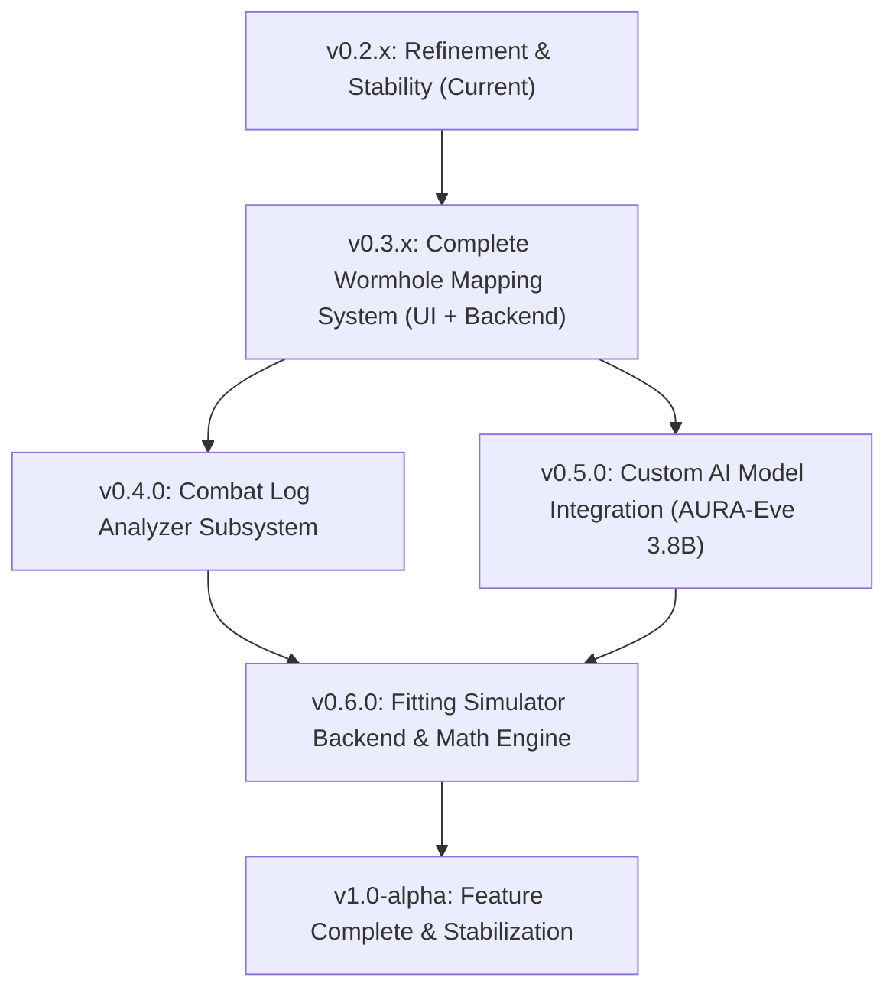

# A.U.R.A Development Roadmap

**A.U.R.A (Adaptive Underworld Recon Array)** is an offline, all‑in‑one EVE Online assistant featuring:
- Real‑time intel parsing & threat scoring
- Wormhole mapping & chain topology visualization
- Fleet composition analysis & doctrine counter-tools
- Real-time combat log parsing & telemetry breakdown
- A custom local AI model (AURA‑Eve Tactical Instruct 3.8B)
- A full offline fitting simulator & Dogma calculation engine

This roadmap outlines the planned development milestones from **v0.2.x** through **v1.0‑alpha**, focusing on stability, performance, and strict subsystem isolation.

---

## Architectural Principles & Subsystem Isolation

1. **Strict Subsystem Isolation**: Modules (`intel`, `wormhole`, `combat_log`, `ai`, `fitting`, `map`) operate with clear data models and event boundaries. No subsystem directly mutates UI state or another subsystem's internal memory.
2. **Offline-First & Local Compute**: All calculations (EVE SDE data, fitting simulations, combat log parsing, graph routing, GGUF inference via llama.cpp) run strictly locally.
3. **Async Event-Driven Bus**: Cross-subsystem communication (e.g. Combat log -> Fitting, Intel -> WH Map, AI Summarizer -> Notifications) runs asynchronously without blocking the UI thread (PyQt6 signals / QThread workers).

---

## Milestone Breakdown

---

## v0.2.x — Refinement Cycle (Current)
Stabilize the new UI and refine the five major features introduced in 0.2.0.

### Goals
- **Intel & Threat Accuracy**: Improve regex and heuristics for system name parsing, ship class detection, threat level calculation, and stale intel expiration.
- **Map Tool Polish**: Refine map rendering, solar system lookup performance, and route plotting.
- **Fleet Composition Tool**: Refine role distribution, counter recommendations, and composition summary metrics.
- **Fitting UI Polish**: Refine slot layouts, module drag-and-drop / search widgets (UI polish before backend engine integration).
- **Installer & Packaging Reliability**: Improve Inno Setup / PyInstaller packaging scripts for clean installs.
- **General Bug Fixes & UX Polish**: Theme consistency, error logging, and stability fixes.

---

## v0.3.x — Complete Wormhole Mapping System (UI & Backend)
Consolidate all wormhole mapping, canvas visualization, signature tracking, and chain backend logic into the **v0.3.x** release cycle.

### Sub-Milestone Roadmap:

#### 1. UI & Visual Chain Builder (`v0.3.0`)
- **Node Editor Canvas**: Interactive `QGraphicsScene` / `QGraphicsView` canvas for dragging, dropping, and organizing solar system nodes and wormhole connections.
- **Wormhole Class & Effect Badges**: Visual badges for C1–C6, Thera, Pochven, High/Low/Null-sec, and system effects (Pulsar, Wolf-Rayet, Black Hole, etc.).
- **Connection Visualization**: Color-coded links representing connection states (mass stage & lifetime stage).
- **Chain Editing Controls**: Add, link, edit, and delete systems and connections on the fly.
- **WH Tab Layout & Ergonomics**: Ergonomic multi-panel layout with collapsible sidebars and HUD view.

#### 2. Signature Tracking & Parsing (`v0.3.1`)
- **Signature Tracking UI**: Live table displaying ID, Group, Type, Signal Strength, Age, and Status.
- **Clipboard Signature Ingestion**: Intelligent paste parser for EVE Online Cosmic Signature and Cosmic Anomaly clipboard formats (`ABC-123 Cosmic Signature Relic Site ...`).
- **Signature State Machine**: Automatic matching, duplicate resolution, update timestamps, and manual status toggling.

#### 3. Graph Engine & Topology Backend (`v0.3.2`)
- **Chain Persistence Engine**: Local SQLite / JSON persistence for active and archived wormhole chains with full undo/redo state management.
- **Mass & Lifetime Tracking**: Dynamic state tracking for mass stages (Stage 1 > 50%, Stage 2 10%–50%, Critical < 10%) and lifetime decay timers with automated status transitions.
- **Static & Connection Validation**: Validation against EVE SDE static tables and known wormhole type definitions (e.g. K162, D845, H296).
- **Import / Export**: Standardized JSON chain export/import format for team sharing and local backups.

#### 4. Subsystem Integration (`v0.3.3`)
- **Intel Cross-Referencing**: Link active chain systems to the Intel parser to flag hostiles reported within X jumps of any system in the wormhole chain.
- **Map & Routing Bridge**: Route calculations from k-space exits to major trade hubs (Jita, Amarr, Dodixie, Rens).

---

## v0.4.0 — Combat Log Analyzer
Add real-time combat log parsing and tactical telemetry analysis.

### Goals
- **Combat Log Parser**: Tail and parse real-time EVE Online client combat gamelogs (`Documents/EVE/logs/Gamelogs`).
- **Damage Breakdown**: Live incoming and outgoing DPS, alpha strike tracking, damage type distributions (EM/Thermal/Kinetic/Explosive), and weapon tracking quality (Miss, Glancing, Penetrates, Wrecks).
- **Module Usage Timeline**: Chronological event timeline showing repair cycles, hardener activations, cap boosters, and electronic warfare events.
- **Integration with Fitting UI**: Import observed damage profiles directly into the fitting lab for defensive optimization.
- **Integration with Fleet Comp Tool**: Feed observed enemy fleet weapon profiles into the fleet counter evaluator.

---

## v0.5.0 — Custom AI Model Integration
Integrate the **AURA‑Eve Tactical Instruct 3.8B** model as a first‑class subsystem.

### Goals
- **Model Loader (GGUF)**: Local inference via `llama.cpp` with automatic GPU offloading (CUDA / Vulkan / CPU fallback) and hardware detection.
- **Model Settings Panel**: Temperature, max tokens, context window size, persona selection (Analytical, Tactical, Minimal).
- **Model Memory & Context Pipeline**: Context aggregator that builds dynamic prompts from current Intel, WH chain status, and combat telemetry.
- **AI-Driven Tactical Features**:
  - Intel summaries & threat warnings ("Hostile fleet detected 2 jumps out").
  - WH chain safety, mass risk, and scout recommendations.
  - Fleet composition evaluation and doctrine counters.
  - Tactical fitting advice and module recommendations.
- **Performance Tuning**: Memory management, response streaming, and async non-blocking generation.

---

## v0.6.0 — Fitting Backend
Build the full deterministic fitting simulation engine.

### Goals
- **Slot & Hardpoint Logic**: High/Medium/Low/Rig/Subsystem slot validation, Turret and Missile hardpoint limits, and calibration budgets.
- **Dogma Math & Stacking Penalties**: Recursive stacking penalty formulas ($S(n) = e^{-(n/2.67)^2}$) applied to modules and rigs.
- **Capacitor Simulation**: Dynamic capacitor delta simulation (stable % vs time to empty, cap booster injection rates).
- **CPU & Powergrid Math**: Precise resource budget calculation factoring in skills, implants, and ship bonuses.
- **Resist Profiles & EHP**: Omnipresent and damage-specific Effective HP calculations.
- **DPS Calculations**: Raw, weapon-specific, and applied DPS (incorporating missile velocity/radius math and turret tracking).
- **Tactical Evaluation & Fit Scoring**: Algorithmic scoring against common doctrine archetypes.
- **Subsystem Integration**: Seamless export/import to/from EFT/Pyfa formats and live Intel/Combat bridges.

---

## v1.0‑alpha — Feature Complete
Deliver a fully functional assistant.

### Goals
- **Stable UI & Workflows**: End-to-end polish, responsive layouts, customizable HUD overlay mode.
- **Stable WH Mapping**: Rock-solid chain topology, signature tracking, and team export.
- **Stable Fitting Backend**: Validated Dogma simulation matching in-game metrics.
- **Custom AI Model Fully Integrated**: Real-time context awareness and tactical assistant copilot.
- **Documentation Overhaul**: Comprehensive user manual, developer API docs, and quickstart guides.
- **Installer Polish**: Robust single-click installer with automatic runtime/dependency checks.
- **Logging & Error Handling**: Unified logging, automated crash recovery, and diagnostic reporting.
- **User Settings Panel**: Centralized configuration for audio alerts, paths, graphics, and AI preferences.
- **Stability & Performance Pass**: Memory optimization, startup speed enhancements, and full regression testing.
